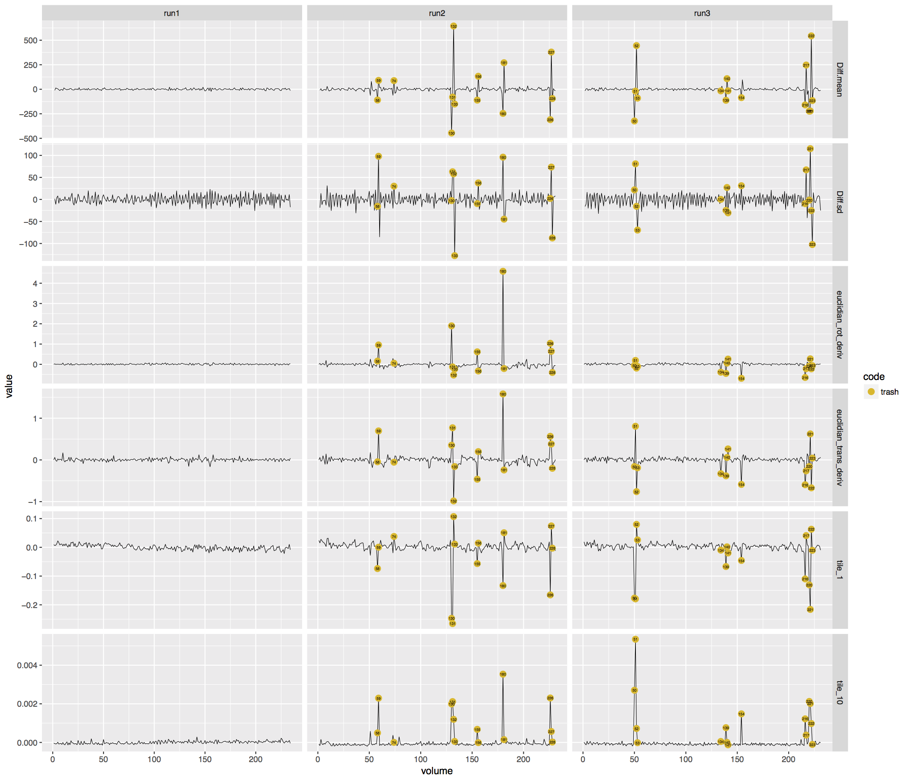

# auto-motion
Scripts for automated assessment of motion artifacts in fMRI data based on changes in global intensity and translation and rotation parameters.

## Pacakge installation on a SLURM cluster

To install the required packages you can use the SLURM-ready script, "install_packages.bash" by running `sbatch install_packages.bash`. 

### First time using R on a SLURM cluster

However, if you have not already specified a user-writable package location (e.g., if you've never run R on your SLURM cluster), this is likely to fail because
it will try to save packages in the system package library. You can easily set a default user library by running R and installing an arbitrary package:

```bash
SLURM-system $ srun --pty --mem 8000 /bin/bash
SLURM-system-n002 $ module load R gcc
SLURM-system-n002 $ R
> install.packages('devtools')
```

When asked if you want to create a new library directory, answer "y" and allow installation to complete. When done, you can exit R using `q()` and answering "n" 
to the question you're asked about saving the workspace image, and then log out of the temporary node you logged into with `srun` by typing `exit`. You can now 
run the above instructions.

## To use this package, run the scripts in the following order:

### 1. `calculate_global_intensities.r`
This script reads in nifti files and calculates the mean global intensity and standard deviation for each functional volume specified.

Edit options for this script in "calculate_global_intensities_config.R". If you are running this on a SLURM cluster, use `sbatch run_calc_glob_intens.bash` to run this job across 28 cores (or however many you prefer to specify in the header of the bash script).

### 2. `motion_check.r`
This script takes the rp text files generated during realignment and calculates Euclidian composite scores for X,Y,Z translation and pitch, yaw, roll rotation.

### 3. `auto_trash.r`
This script integrates global intensity values and Euclidian distance measures to determine which volumes have motion artifacts. Outputs include new rp_txt files with a trash regressor for motion artifacts, summaries of number and percent of trash volumes per subject and run, and plots of volumes by trash status for mean intensity, intensity standard deviation, and Euclidian rotation and traslation.

**Example plot**

